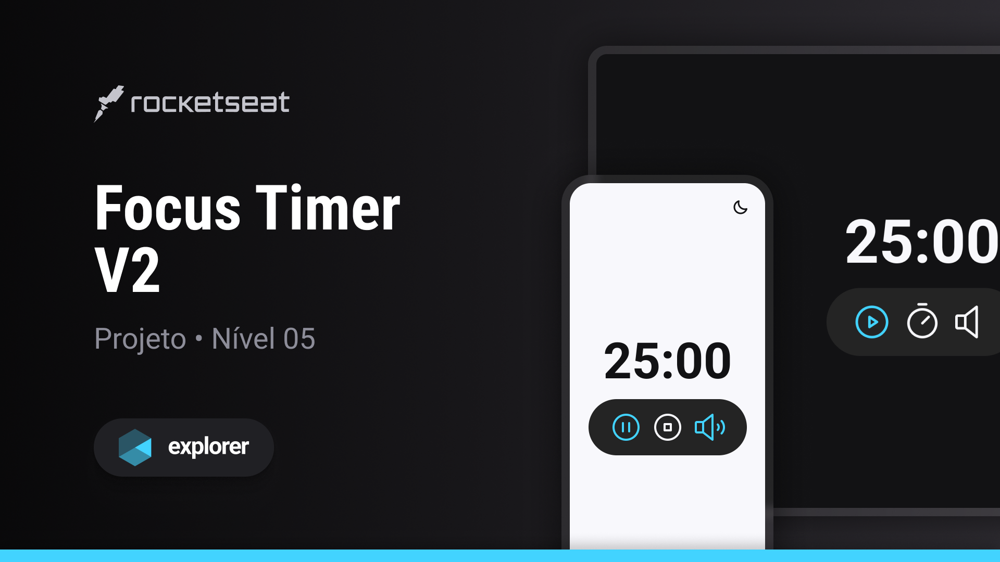

# Focus Timer
feito no curso Explorer da Rocketseat.

## Tecnologias
- JavaScript  
- HTML  
- CSS  
- Git

## Layout
Feito com base [nesse](<https://www.figma.com/file/IAj087OeHvErCDuM4LLqAF/Focus-Timer-V2-%E2%80%A2-Projeto-Explorer-(Community)?node-id=1422%3A28&mode=dev>) layout do Figma.

  

